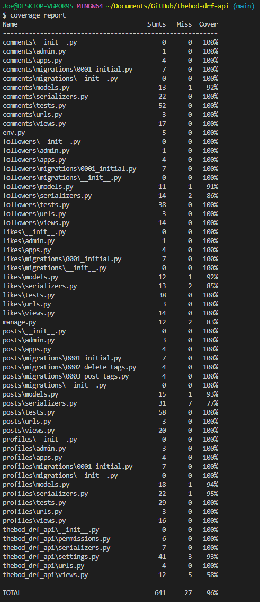

<h1 align="center">TheBod Django Rest Framework API - Project Portfolio 5</h1>


## - By Joe Playdon

### [View the live project here](https://thebod-blog.herokuapp.com/) #
### [View the deployed API here](https://thebod-app.herokuapp.com/) #
### [View the API repository here](https://github.com/bodthegod/thebod-drf-api) #


# Table of Contents:
1. [User Stories](#user-stories)
2. [Database Model Structure](#database-model-structure)
3. [Languages and Technologies Used](#languages-used)
4. [Testing](#testing)
    - [Validation](#validation)
5. [Bugs and fixes](#known-bugs)
6. [Credits](#credits)


## User Stories

From the backend perspective of this API, the user stories are CRUD focused and authentication focused.
1. As an admin, I want create functionality of all profiles, posts, likes and comments.
2. As an admin, I want update functionality of all profiles, posts, likes and comments so that I can edit any content I choose to.
3. As an admin, I want delete functionality of all profiles, posts, likes and comments so that I can delete any content that may be deemed as harmful.

## Database Model Structure


### Profile Model

- This model is directly linked in a one to one relationship with the User model, imported from django-allauth.
- The Profile model contains all fields that are associated with a profile when a user creates one. These fields are as such:
1. owner = OneToOne with User field
2. created_at = DateTimeField
3. updated_at = DateTimeField
4. name = CharField
5. content = TextField
6. image = ImageField with default profile image

### User Model

- This model is imported from django-allauth, and is integrated within all functional model classes.
- The User model contains multiple fields associated with all foreign models within my app:
1. Profile model = owner field holds OneToOne relationship with User
2. Posts model = owner field holds ForeignKey relationship with User
3. Likes model = owner field holds ForeignKey relationship with User
4. Followers model = owner & followed fields hold ForeignKey relationship with User which are related to following & followed
5. Comments model = owner field holds ForeignKey relationship with User

### Post Model

- The Post model contains all fields that are associated with a post when a logged in user creates one. These fields are as such:
1. owner = ForeignKey with User field
2. created_at = DateTimeField
3. updated_at = DateTimeField
4. title = CharField
5. tags = CharField with choices from tags_array
6. content = TextField
7. image = ImageField with default post image

### Follower Model

- The Follower model contains all fields that are associated when a logged in user attempts to follow another profile, as such:
1. owner = ForeignKey with User field
2. followed = ForeignKey between User field and followed field
3. created_at = DateTimeField

### Like Model

- The Like model contains all fields that are associated when a logged in user attempts to like a created post, as such:
1. owner = ForeignKey with User field
2. post = ForeignKey between Post model field and likes field
3. created_at = DateTimeField

### Comment Model

- The Comment model contains multiple fields associated with content related to comments, as such:
1. owner = owner field holds ForeignKey relationship with User model
2. post = post field holds ForeignKey relationship with Post model
3. comment_info = TextField for comment input
4. created_at = DateTimeField
5. updated_at = DateTimeField

## Languages and Technologies Used

- This project was primarily created with python, a computer programming language often used to build websites and software, automate tasks, and conduct data analysis.

- To create this API, I used Django. Django of often referred to as a "batteries included" framework, which enables for rapid development of secure and maintainable websites due to the toolkit it provides. 

### Tools Used

- [Visual Studio Code](https://code.visualstudio.com/) my preferred coding environment.
- [GitHub](https://github.com/) to store my code repositories.
- [Git](https://git-scm.com/) was used to commit and push my code changes.
- [Heroku](https://dashboard.heroku.com/apps) was used to host my repositories and deploy my API.
- [Coverage](https://coverage.readthedocs.io/en/7.2.1/#) was used to check the coverage of my automated tests.
- [Django Rest Framework](https://www.django-rest-framework.org/) was used in many instances to create and add features to my API.
- [Django API Testing](https://www.django-rest-framework.org/api-guide/testing/) was used to create tests and run them to test the effectiveness and robustness of my API.
- [Cloudinary](https://cloudinary.com/) was used to store the static files tied to general styling and user features.
- [PostgreSQL](https://www.postgresql.org/) was used to store the data inside my relational database tied to all things user related.
- [Pillow](https://python-pillow.org/) was used for image input validation (resolution and dimension filtering).
- [Psycopg2](https://pypi.org/project/psycopg2/) database adapter for Python.

## Testing

In order to ensure my API was functioning correctly, I have ran both manual and automated tests for a user, and admin. 

### Validation

- [PEP8 Linter](https://pep8ci.herokuapp.com/) I used this PEP8 linter to ensure my code was PEP8 compliant and my code was validated. I tested every .py file of which all passed with success.


### Automated Testing

For automated testing I have imported APITestCase from rest_framework.test, which allowed me to create specific tests for each function within my app.

- Testing summary of all automated tests 

 

- Here I used the [Coverage](https://coverage.readthedocs.io/en/7.2.1/#) Tool and commands (```$ coverage report``` and ```$ coverage html```) to create this summary. This shows the overall coverage of my tests of my API.

<details><summary>TheBod API Test Coverage Report</summary>

</details>

### Manual Testing

These are tests I have run manually by testing all functionality through the admin side of my API.

| # | Model Test | Functionality | Expected Action | Actual Action |
| --- | --- | --- | --- | --- |
| 1 | User Model | CRUD functionality of a User | A User can be created, read, updated or deleted | This works correctly |
| 2 | Profile Model | CRUD functionality of a Profile | A Profile can be created, read, updated or deleted for a User (has to be own profile) | This works correctly |
| 3 | Posts Model | CRUD functionality of a Post | A Post can be created, read, updated or deleted for a User (has to be for own post) | This works correctly |
| 4 | Likes Model | Create and delete functionality for likes | A Like can be added or removed from a post if a user is logged in (cannot like own post) | This works correctly |
| 5 | Follower Model | Create and delete functionality for followers | A Follow can be added to a user or removed (has to be logged in) | This works correctly |
| 6 | Comments Model | CRUD functionality of a comment | A Comment can be created, read, updated or deleted associated with a post (has to be own comment) | This works correctly |

## Known Bugs

There was one major bug that I discovered when creating this API, as shown below.

- An issue where dependencies would not install correctly based upon my version of python and where the files are held. To fix this- I created a Pipfile to manage my project packages for this specific project. When running my API locally, always run (```$ pipenv shell```) in the terminal to ensure the project is using the correct dependencies.

## Credits
- Default post placeholder image was taken from [here](https://allchildrenlearning.org/resources_type/international-development-and-early-learning-assessment-idela/) and edited using [pixlr](https://pixlr.com/x/) to make it purple.
- Default user icon was taken from [flaticon](https://www.flaticon.com/free-icon/user_813252)
- Inspiration from this API was taken from the [Moments](https://github.com/Code-Institute-Solutions/drf-api) walkthrough project from Code Institute and helped within the guidance and steps of creating this API.

